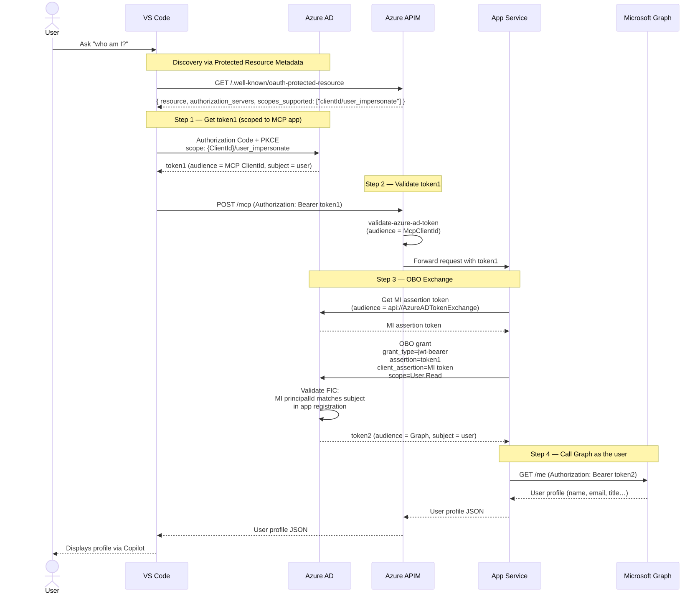

# Full Auth Chain Using On-Behalf-Of (OBO)

Here's the full auth chain that uses OBO:

```
VS Code → APIM → App Service → Microsoft Graph
   (token1)  (token1)  (token1→OBO→token2)
```



## Step 1 — VS Code gets token1 (for the MCP app)

VS Code reads the PRM endpoint (`/.well-known/oauth-protected-resource`) which the APIM policy in [mcp-prm.policy.xml](/infra/app/apim-mcp/mcp-prm.policy.xml) returns. That document says: go to Azure AD, request scope `{McpClientId}/user_impersonate`. VS Code does this and gets an access token **scoped to the MCP app registration** (audience = `5961eed8-c21f-494c-b5b6-93bc8ed4e055`).

## Step 2 — APIM validates token1

[mcp-api.policy.xml](/infra/app/apim-mcp/mcp-api.policy.xml) runs `validate-azure-ad-token` against the MCP ClientId audience. If valid, it passes the token through to the App Service unchanged.

## Step 3 — App Service performs the OBO exchange

In [GraphClientHelper.cs](/src/api/Utilities/GraphClientHelper.cs), `OnBehalfOfCredential` is created with:

- `userAssertion` = token1 (the user's MCP token)  
- `clientAssertionCallback` = a token from the **Managed Identity** scoped to `api://AzureADTokenExchange`

When `graphClient.Me.GetAsync()` is called, MSAL calls Azure AD's token endpoint with `grant_type=urn:ietf:params:oauth:grant-type:jwt-bearer`. Azure AD sees:

- "Here's a user token for my app (proven by the MI federated credential)"
- "Give me a **Microsoft Graph** token **on behalf of that same user**"

Azure AD validates the FIC (the MI's `principalId` matches the `subject` in [mcp-entra-app.bicep](/infra/app/apim-mcp/mcp-entra-app.bicep)), then issues token2 scoped to `User.Read` on Microsoft Graph — but **carrying the user's identity**, not the app's.

## Why This Matters

Microsoft Graph sees the call as the signed-in user (not a service account), so `/me` returns *their* profile. The App Service never holds a user password or refresh token — it only ever has token1 to exchange once.
